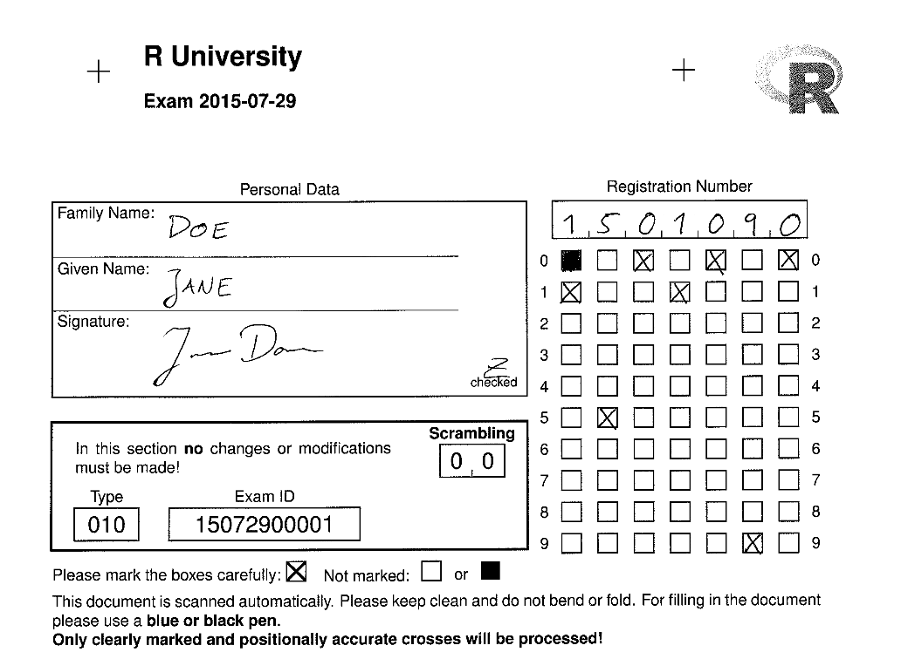

```{r setup, include=FALSE}
knitr::opts_chunk$set(echo = TRUE)

```

R can be used to create, scan, and correct student exams. This blog introduces the R exams package and shows how the approach works based on demo exam files that come with the package. I demonstrate how R scans exam images, extract answers from single or multiple choice questions, and correct them automatically. Next, I underline typical next steps that are related to this kind of work and how they are implemented in R (e.g., create a document with the exams results). Finally, I highlight how you can create your own exam question. This blog shows how the package works to encourage people with little R experience to use the exams package.

You can download this article and the source code from my [GitHub](https://github.com/edgar-treischl/medium) repository.


## The R exams package


As university instructors, we are creating exams and we use often multiple-choice questions to assess the knowledge of our students. I don’t know how many times I have manually corrected an exam which is why this blog gives a short introduction and shows why you should consider the R `exams` package for single or multiple choice exams. The package provides features to automate the entire process, from generating the exam up to assigning grades. 

First, why should you consider R for exams? The exams package helps you to generate, scan, and assess the exam. It helps you to create a scan sheet that your students fill out in the exam. After the exam, you can use a regular copy machine to scan the sheets. The exams package scans those images, assess students’ answers, and provides documents with the results instantly. That is an awesome reason. Furthermore, it helps you to reduce mistakes because students’ answers are no longer corrected manually and it returns a HTML file for each participant that shows the scan sheet, the given and the correct answers, and how many points the person has earned.

In order to use exams, we need to setup a folder that contains all the question of the exam, we need the images of the exam to extract the information and we have to assess the students’ answers. Give it a try and learn how each step works before you setup your own exam, because the exams package comes with a nice tutorial and all necessary demo files to create and scan an exam. The next subsections give a quick summary of the demonstration from the website, but you can find a step-by-step guide on the R [exams website](http://www.r-exams.org/tutorials/exams2nops/) website as well.


## The demo from the R exams package

Before we can start to create the exam, we need exercises or exam questions and the package provides a list of exercises files that we can download on the website. Make a new folder where all the files will be stored. Copy the exercises from the website and save them in a new folder named exercises. Next, create a new R script, install and load the library.

```{r}
#install.packages("exams")
library(exams)
```


As a first step, we need to decide which questions should be included in the exam. Therefore, we create a list that stores questions names. In the last section, we will see how to create our own questions, but as first step it is fine if we use the questions provided by the exams package. As the next output shows, I created a list (`exercises_exam`) with several example questions:


```{r}
#setup a list of (example) exam questions
exercises_exam <- list(
  "tstat2.Rnw",
  "ttest.Rnw",
  "relfreq.Rnw",
  "anova.Rnw",
  c("boxplots.Rnw", "scatterplot.Rnw"),
  "cholesky.Rnw"
)

```

Second, I use this list to create the exam with the help of the `exams2nops()` function. The latter creates a PDF file based on the `exercises_exam` list and adds the scan sheet as first page. As the exams package outlines, you may want to set a seed to reproduce the results and we assign the exam as `test_exam`.


```{r, eval=FALSE}
#Create a PDF for the exam
set.seed(403)
test_exam <- exams2nops(exercises_exam, 
                  dir = "nops_pdf", 
                  name = "demo", date = "2015-07-29",
                  points = c(1, 1, 1, 2, 2, 3),
                  n = 2)
```


There are several options how to adjust the exam and you may check the documentation to adjust the minimal code for your own purposes. As the minimal code shows, we need to provide the directory (`dir`) where the pdf will be stored (here: `nops_pdf`), a name and the date of the exam; and I created two different versions of the exam (with randomized order of the questions), but you can create more versions if you want to. In addition to the pdf files, the `exams2nops()` function saves a `.rds` file in the directory which contains all of the meta data about the exam (e.g. solutions). We will see where this information is coming from in the last section.

The package provides everything that is needed for a test run and includes also test exam images. The next code snippet saves two example scan files as `scan_image`. We can use the two files to see how we can evaluate images and scan an exam.


```{r, eval=FALSE}
#Use example images to check out how it works
scan_image <- dir(system.file("nops", package = "exams"), 
           pattern = "nops_scan",
           full.names = TRUE)
```


All of the scan images must be stored in one directory. Create a new directory with `dir.create("nops_scan")` where the scan files will be saved and the second line of code copies the demo files `scan_image` into the `nops_scan` folder with `file.copy()`.

```{r, eval=FALSE}
#Create a folder and copy images
dir.create("nops_scan")
file.copy(scan_image, to = "nops_scan")
```

After you run this code chunk, two fake scan images appear in your folder, one from Ambi Dexter and another one from Jane Doe, as the next figure illustrates.




After we have prepared all the essential steps, we use the `nops_scan()` function to scan the images. It trims and rotates the files and extracts the information from the PNG.

```{r,eval=FALSE, message=FALSE}
#Scan images
nops_scan(dir = "nops_scan")
```

Have a look in your directory. The `nops_scan()` function saves the result as a archive, which includes the png files as well as a text file with the extracted information.

Before we can finally evaluate the results, we need a list with the information of our students to match them with the results of the exam. The minimal example gives you a code snippet to create a csv file that contains the information about the two fake students from the demo.


```{r, eval=FALSE}
#Who participates the exam? Load data or use example data 
write.table(data.frame(
  registration = c("1501090", "9901071"),
  name = c("Jane Doe", "Ambi Dexter"),
  id = c("jane_doe", "ambi_dexter")), 
  file = "Exam-2015-07-29.csv", sep = ";", quote = FALSE, row.names = FALSE)
```

Finally, we can use the `nops_eval()` function to evaluate the scanned images. The `register` points to the students’ matching list, `solutions` points to the meta data of the exam, `scans` provides the directory and name of the scan results, `eval` determines how the results are evaluated (e.g. do we give partial points), and `interactive` gives information whether errors should be handled interactively or not. Check out the documentation of `nops_eval()` for more information.

```{r, eval=FALSE, fig.keep='none'}
#Extract/Eval information from images
exam_results <- nops_eval(
  register = "Exam-2015-07-29.csv",
  solutions = "nops_pdf/demo.rds",
  scans = Sys.glob("nops_scan/nops_scan_*.zip"),
  eval = exams_eval(partial = FALSE, negative = FALSE),
  interactive = TRUE
)
```

Anyway, the `nops_eval()` returns a data frame that contains the answers, solutions, and given points for each student!


```{r, eval=FALSE}
#Inspect results
exam_results
```


Checkout your folder. The `nops_eval()` function has already exported the exam file and it created an archive that contains a short summary document of the exam results for each student. As the next figure shows, it displays the meta information of your students, an assessment of each question, and the image of the scan sheet used to extract the information. Thus, you are really prepared if your students show up to review the exam.


Thus, the `exams` package reduces a lot of pain when it comes to correct exams and I really hope, that I have convinced you that you can handle the discussed steps, even if you have limited experience using R. To boost the popularity of the package, and to convince you that you should stick to R for the next steps as well, the next section shows you how can use R to prepare the data and automate the process to communicate the exam results. Sure, you can use any software to finalize the data, but R gives you some nice features to automate this process and you can even use R to make a summary document for your students without much effort. Unfortunately, this implies that I assume in the next section that you have basic R knowledge.


## R is your exam friend

How do we communicate the results of the exam and how can we automate this process? The data is saved as `nops_eval.csv` and we can use R to wrangle the exam data, prepare a final list with the results (a list to enter grades in the educational system), and to communicate the exam results.

Obviously, the exam data is already loaded, but we have to import the data if we want to provide a short summary for the participants or if we want to rerun the data management steps. Thus, use the `readr` package to import the data and the `tidyverse` approach for data wrangling. If you are not familiar with loading data in R, import the data with the import data function in RStudio. It gives you a preview of the data, shows you the corresponding packages and the code to import the data. As the following code snippet shows, you can read a delimited file (including csv & tsv) with the `read_delim()` function and we have to tweak the delimiters, because our file contains semicolons instead of commas to separate values.


```{r, eval=FALSE}
#Load data
library(readr)
exam_df <- read_delim("nops_eval.csv", 
                        ";", escape_double = FALSE, trim_ws = TRUE)
```


Next, I exclude all variables which are not longer necessary for the report after importing that data. The `dplyr` package gives a lot handy functions to work with data and the package is included in the `tidyverse` package. We can use the `select()` function to make a narrow data frame with an ID variable (register number) and the points variable from the exam data only. I generated some fake data to illustrate this process, but the code shows you furthermore how you can save a new data frame with the selected variables:


```{r, message=FALSE, warning=FALSE}
#Fake example data
library(tidyverse)
exam_df <- tribble(
  ~ID, ~points,
   1, 57,
   2, 60,
   3, 84,
   4, 45,
   5, 82
)

exam_df <- exam_df  %>% 
  select(ID, points)
exam_df

```

Again, the exam package makes our life very easy since there is not much to do which is why I try to encourage people to use R even if you have little experience using it. As the next code chunk illustrates, we have to generate a new variable that stores the grade depending on the points people have achieved. Use `mutate()` to extend the data frame and the `case_when()` function assigns grades in accordance to the points of the exam. I decided that grade level goes from 100 to 50 points with a range of 5 points for each grade level, but that is not the important point here. The `case_when()` function checks whether the condition (e.g. `points >= 95 ~ 1.0`) is fulfilled and assigns the corresponding grade if that’s the case. Let’s see how it works:


```{r}
#Give grades according to points
exam_df <- exam_df %>% 
  mutate(
    grade = (
      case_when(
        points >= 95 ~ 1.0,
        points >= 90 ~ 1.3,
        points >= 85 ~ 1.7,
        points >= 80 ~ 2.0,
        points >= 75 ~ 2.3,
        points >= 70 ~ 2.7,
        points >= 65 ~ 3.0,
        points >= 60 ~ 3.3,
        points >= 55 ~ 3.7,
        points >= 50 ~ 4.0,
        points <= 49 ~ 5.0
      )
    )
  )

exam_df
```

As the output shows, Person 1 has 57 points and gets the grade 3.7 (German grading system); person 4 gets the grade 5 because he/she has achieved less than 50, and so on. Please check each grade level to make sure that there are no mistakes, no typos, or any other problems.


The next steps depend on how you have to enter the grades in your higher educational system. For instance, I need a sorted list and the grades multiplied by 100 at my university. Nothing easier than that, use `mutate()` again to extend our data frame with an additional grade and use `arrange()` to sort the data.

```{r}
#Arrange and check if data preparation steps really worked
exam_df %>% 
  mutate(grade_system = grade * 100) %>%
  arrange(ID)
```

Finally, I need to match the exam list with a list of students who have actually registered for the exam, but some did not show up in the exam. This step also depends on what your institution wants from you, which makes it hard for me to give you any useful advice. You may want to check out how to merge data (in my case I used a `left_join()`); after I merged the data, I save the final results with the `readr` package, for example, as a csv file.


```{r, eval=FALSE}
#In case you need to save your results
write_csv(final_results, "final_results.csv")
```

Thus, you can create, scan and correct exams even if you have only limited knowledge about R, but I know from my own experience that the start can be tricky and we all need sometimes an incentive.

I guess reducing mistakes when correct exams is already an huge incentive, but you can also use R to generate a small report for your students. You may want to check out [`rmarkdown`](https://rmarkdown.rstudio.com/) which let you easily create different files (pdf, html, word) and I have a standard document for my students that contains a table as well as a histogram that depicts the exam grades. The next console shows the code to generate such a histogram with the help of the [`ggplot2`](https://ggplot2.tidyverse.org/) package.


```{r}
#Inspect the results visually
mean_grade <- exam_df %>% 
  pull(grade) %>% 
  mean() %>% 
  round(2)

#Plot it
ggplot(exam_df, aes(x=grade)) +
  geom_histogram(colour="black", fill="white", bins = 11)+
  geom_vline(xintercept=mean_grade, size=1.5, color="red")+
  geom_text(aes(x=mean_grade+0.5, label=paste0("Mean\n",mean_grade), y=8))+
  theme_minimal(base_size = 14)
```

The ggplot2 package, rmarkdown, r-exam, maybe you feel a lit bit overwhelmed depending on your background. I just wanted to outline the advantages if we create all steps in the same environment, and R gives you the possibilities to do all essential steps when it comes to exams. Moreover, it is very easy to learn rmarkdown or ggplot2 in case you have never heard of it before. I hope that the code examples give you a start how to apply it on your own. You could even have my own RMarkdown template, but RStudio comes with several rmarkdown templates and if you copy the code from above, you have essentially the same as I use.


From my opinion there is only one thing left for me to do. You have to create your own exercises before you can think of using R for your exams.

## Create your own exercises

The next output shows you an example of an exercise. The exercises need to be available as a Markdown or a RMarkdown file. Obviously, another good reason why you want to learn more about RMarkdown. Anyway, even if you are not familiar with both, creating new exercises is easy and the structure of the exercises is not complicated.


    Question
    ========
    What is the question?

    Answerlist
    ----------

    * A
    * B
    * C
    * D

    Solution
    ========
    A and C

    Answerlist
    ----------
    * True
    * False
    * True
    * False

    Meta-information
    ================
    exname: question1
    extype: mchoice
    exsolution: 1010
    exshuffle: TRUE


I don’t think there is much to say how to provide a question, answerlist or the solutions. So, let’s have a look at the meta-information at the end of the exercise. In this section you have to outline whether you use a single (`schoice`) or multiple choice (`mchoice`); `exsolution` points to the binary string code for the solutions, here A and C are right which leads to 1010. Ultimately, you can decide whether the answers of the questions is shuffled or not.

The R exams package has much more to offer than I could possibly show you. I just tried to give a quick summary how R can be used for exams. Visit the [R exams website](http://www.r-exams.org/) for tutorials, the dynamic exercises, or e-learning tests. But most of all I hope that I could convince some people that learning how to create, scan, and correct exams with R is no magic at all.


